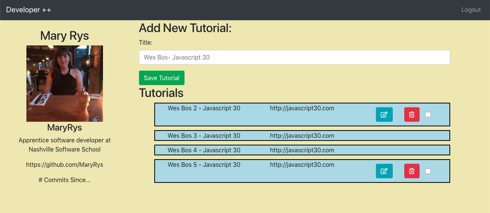

# Developer ++

### Description
Developer ++ is an application that utilizes Github's API and authentication to house an application for students who wish to track tutorials, blogs, podcasts and other resources that may help them on their journey to becoming a developer.

### Technology Used
* HTML5
* Sass
* Bootstrap 4
* React
* Jquery
* Github Version Control

### How to run this app
* This page can be accessed at https://developerplusplus-ee612.firebaseapp.com/
you will need a github account to login (www.github.com).

### Screenshot(s)

### Contributors
Mary Rys

